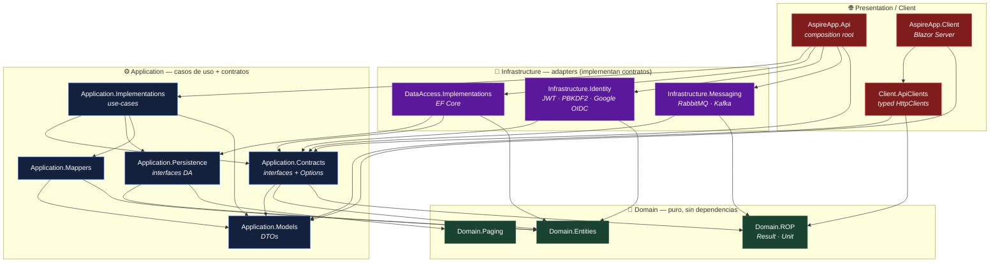
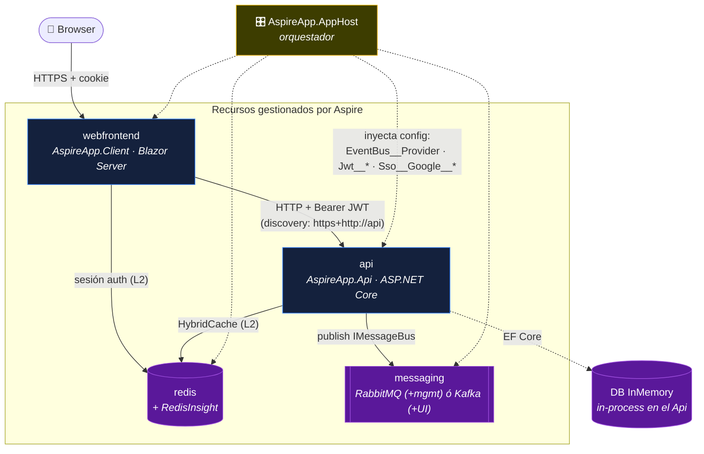

# Arquitectura — AspireApp

Documento visual de la arquitectura: cómo están organizados los proyectos (Clean
Architecture), cómo se despliegan/orquestan con .NET Aspire y cómo se comunican los
componentes en tiempo de ejecución.

> Los diagramas están en [Mermaid](https://mermaid.js.org/) — se renderizan directo en
> GitHub, VS Code (con la extensión Markdown Preview Mermaid) y la mayoría de IDEs.

---

## 1. Mapa de dependencias (Clean Architecture)

Cada caja es un proyecto (`.csproj`). **Las flechas son referencias de compilación
(`depende de`) y siempre apuntan hacia adentro** — hacia el dominio. La infraestructura
implementa contratos definidos en la capa de aplicación (inversión de dependencias): el
núcleo nunca conoce a Kafka, RabbitMQ, EF Core ni los validadores de tokens.

**Regla de oro:** `Domain ⟵ Application ⟵ Infrastructure ⟵ Presentation`.
El `Api` es el único *composition root* que conoce las implementaciones concretas para
registrarlas en el contenedor de DI. `AspireApp.AppHost` y `AspireApp.ServiceDefaults`
(orquestación / telemetría) se omiten aquí para no saturar el grafo.

---

## 2. Topología de ejecución (orquestación Aspire)

Qué levanta `AspireApp.AppHost` y cómo se inyecta la configuración. `redis` y `messaging`
son **contenedores** provisionados por Aspire; la base de datos por defecto es **EF Core
InMemory in-process** (intercambiable por SQL Server / PostgreSQL como recurso externo).

- El **provider del bus** (`EventBus:Provider` = `RabbitMq` | `Kafka`) decide qué contenedor
  se provisiona y se propaga al `api` como variable de entorno. Cambiar de broker = editar
  el setting y reiniciar el AppHost, **sin tocar código**.
- El `webfrontend` es el único con endpoints HTTP externos; descubre al `api` por nombre
  lógico (`https+http://api`) vía service discovery de Aspire.

---

## 3. Flujo de una request en runtime

Dos recorridos típicos: **login** (emite tokens) y **crear producto** (operación autorizada
que además publica un evento al bus). Las interfaces (`IAuthService`, `IProductService`,
`IMessageBus`, `IxxxDA`) viven en la capa de aplicación; las implementaciones concretas se
resuelven por DI hacia la infraestructura.

```mermaid
sequenceDiagram
    autonumber
    actor U as Browser
    participant W as Blazor Client
    participant H as JwtTokenHandler
    participant API as Api Controller
    participant S as Application Service
    participant DA as DataAccess (EF Core)
    participant ID as Infrastructure.Identity
    participant MB as Infrastructure.Messaging
    participant DB as Database
    participant BR as Broker

    rect rgb(20, 33, 61)
    Note over U,BR: Login — POST /api/auth/login
    U->>W: credenciales
    W->>API: login request
    API->>S: IAuthService.LoginAsync
    S->>DA: IUserDA.GetByEmailWithRoles
    DA->>DB: SELECT
    S->>ID: IPasswordHasher.Verify
    S->>ID: IAuthTokenService.CreateAccessToken (JWT)
    S-->>API: Result(AuthenticationResult)
    API-->>W: 200 { access, refresh }
    W->>W: guarda tokens en HybridCache (Redis L2)
    end

    rect rgb(27, 67, 50)
    Note over U,BR: Crear producto — POST /api/product (autorizado + evento)
    U->>W: alta de producto
    W->>H: ProductApiClient.PostAsync
    H->>API: + Authorization: Bearer <access>
    API->>S: IProductService.AddAsync
    S->>DA: IProductDA.AddAsync
    DA->>DB: INSERT
    S-->>API: Result(Product)
    API->>MB: IMessageBus.PublishAsync("product", ...)
    MB->>BR: publish event
    API-->>W: 201 Created
    end
```

> Si el access token expiró, `JwtTokenHandler` recibe un `401`, llama a `POST /api/auth/refresh`
> de forma transparente (rotando el refresh token) y reintenta la llamada original.

---

## Cómo se comunican los componentes — resumen

| Límite | Mecanismo | Detalle |
| --- | --- | --- |
| Browser ↔ Client | HTTPS + cookie + SignalR | Blazor Server interactivo; la cookie `AspireApp.Cookies` guarda solo claims. |
| Client ↔ Api | HTTP/JSON + Bearer JWT | `Client.ApiClients` (typed `HttpClient`); `JwtTokenHandler` adjunta y refresca el token. |
| Api ↔ Application | Llamadas in-process por interfaz | Controllers dependen de `IxxxService` (Application.Contracts), resueltos por DI. |
| Application ↔ Infrastructure | Inversión de dependencias (DI) | La app llama interfaces (`IxxxDA`, `IMessageBus`, `IAuthTokenService`); las implementa la infra. |
| Api/Application ↔ Broker | `IMessageBus.PublishAsync` | Adapter RabbitMQ o Kafka en `Infrastructure.Messaging`; `topic` = routing key / topic. |
| Api/Client ↔ Redis | `HybridCache` (L1 memoria + L2 Redis) | Caché de lectura en el Api; almacén de sesión de auth en el Client. |
| Api ↔ DB | EF Core (`AppDbContext`) | InMemory por defecto; los DA encapsulan el acceso detrás de `Application.Persistence`. |
| AppHost ↔ recursos | Inyección de config | `WithReference`/`WithEnvironment` propagan connection strings y settings. |
